# INIT 3.0

**Manage every event in a festival—or any large occasion—from one platform.**

INIT 3.0 brings event discovery, participant registration, team management,
payments, content administration, and QR-assisted check-in into a single
full-stack platform.

**Documentation:** [Product tour](#product-tour) · [Quick start](#quick-start) · [Architecture](#architecture) · [Demo accounts](#demo-accounts)

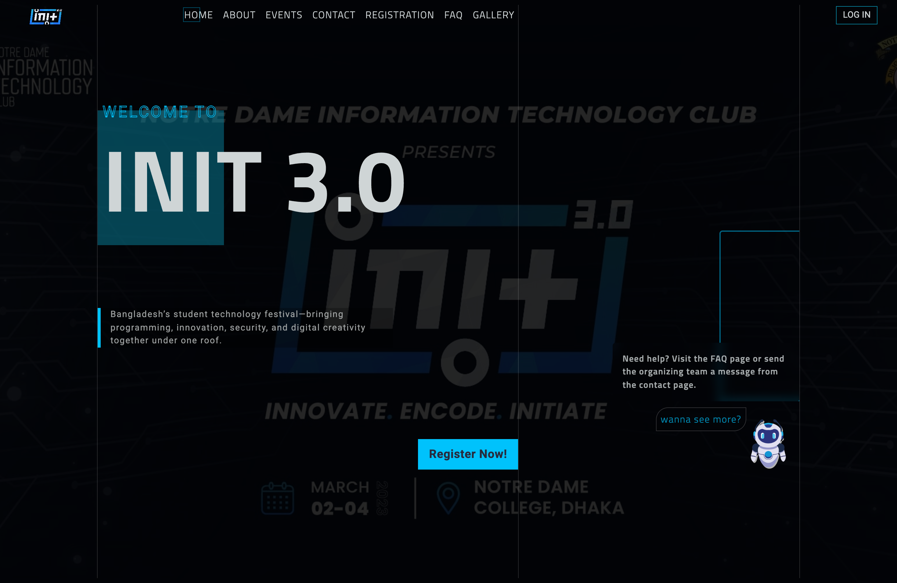

## Why INIT 3.0 exists

A technology festival is more than a list of events. Organizers have to publish accurate information, register people, build teams, track payments, answer questions, manage volunteers, collect submissions, and check participants in on the day. When those jobs live in separate forms and spreadsheets, the same information gets copied repeatedly and mistakes become difficult to trace.

INIT 3.0 keeps that work connected:

| Audience | What they can do |
| --- | --- |
| Visitors | Discover events, read rules and notices, browse festival media, and contact the organizers |
| Participants | Create an account, join individual or team events, submit payment details, and track their event status |
| Campus ambassadors | Register with a referral code, represent the festival, and follow their referral score |
| Organizers | Manage events, participants, payments, communications, content, gallery media, sponsors, and access permissions |
| Check-in operators | Find or scan a participant and update attendance for the correct event |

> [!NOTE]
> This repository is a full-stack demonstration and engineering reference. The seeded organizations are example technology partners and do not imply real sponsorship. Email and SMS flows require credentials from your own providers.

## Project history

INIT 3.0 was originally built to run the **INIT 3.0 National Festival**, organized by the **Notre Dame Information Technology Club (NDITC)** at **Notre Dame College, Dhaka, Bangladesh**. Held from **2–4 March 2023**, the festival marked INIT's return after the COVID-era break with a redesigned program spanning robotics events such as Spot N Go, Soccer Wheels, and Robo War alongside olympiads, programming contests, and other technology competitions.

More than **5,000 students from across Bangladesh** participated in the festival. The platform connected its public event information, registration, participant records, teams, payments, administration, and QR-assisted check-in in one system.

For Notre Dame College, it was the first unified festival-management platform of its kind. After the national festival ended, the live website was retired as planned. Its structure and the lessons learned from running it became a foundation and source of inspiration for the NDITC festival platforms that followed.

This repository keeps that original system available as a real-world engineering reference. Its deterministic demo database recreates the application locally without exposing historical participant information or production credentials.

**Explore the original event:** [Visit INIT 3.0 on Facebook ↗](https://fb.me/e/3pfkfvZvt) · [Read NDITC's festival history](https://init.nditc.net/about)

## Product tour

These views show the seeded application from the visitor, participant, organizer, and check-in perspectives.

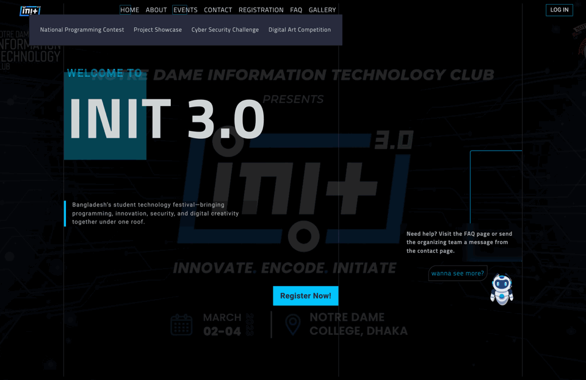

_Public discovery → registration → organizer operations._

<details>
<summary><strong>Public and participant experience</strong></summary>
<br />

<table>
  <tr>
    <td width="50%">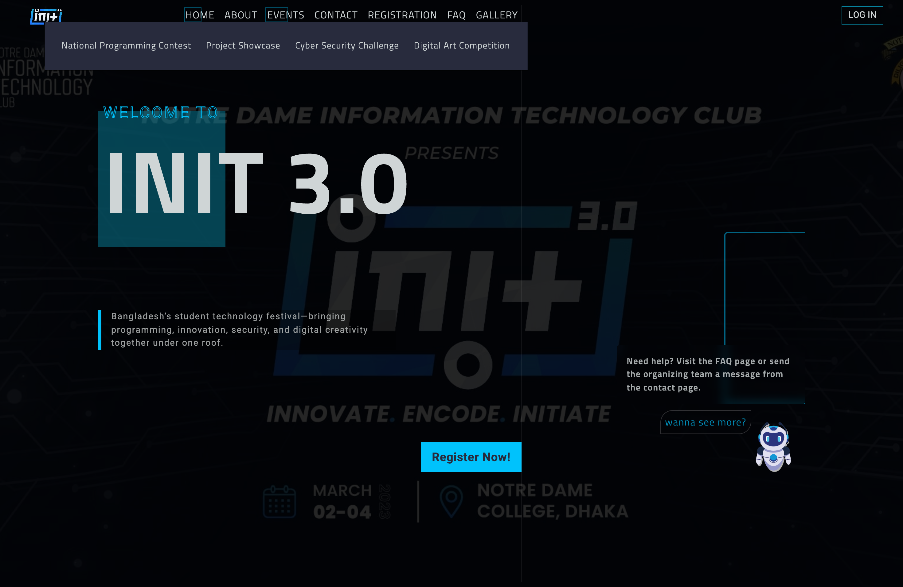</td>
    <td width="50%">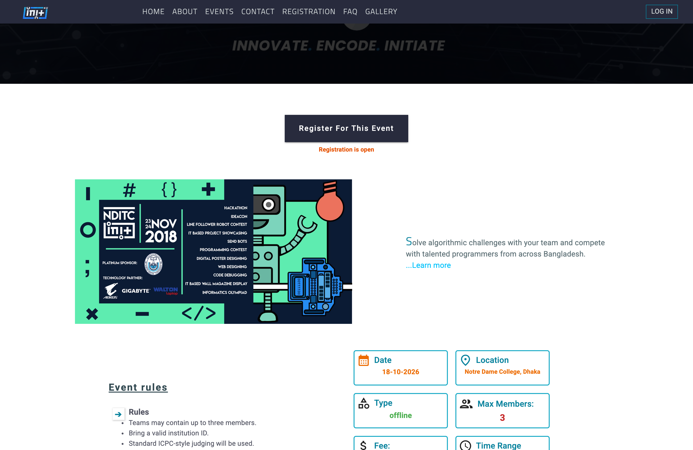</td>
  </tr>
  <tr>
    <td><strong>Discover events</strong><br /><sub>Browse the complete festival program in one catalog.</sub></td>
    <td><strong>Understand the event</strong><br /><sub>Schedule, venue, fee, format, rules, and registration entry point.</sub></td>
  </tr>
  <tr>
    <td width="50%">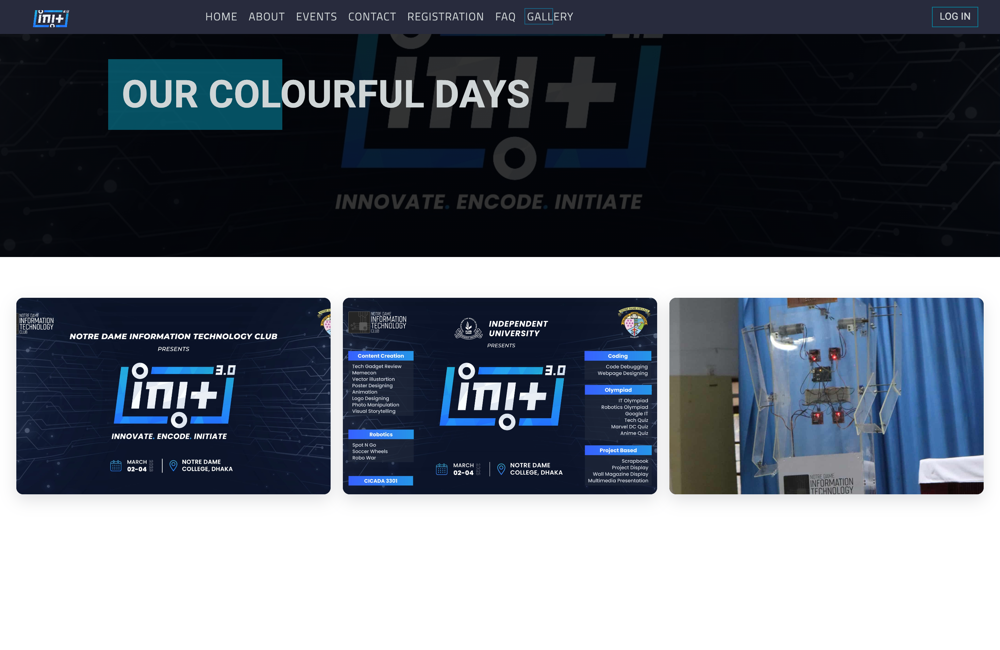</td>
    <td width="50%">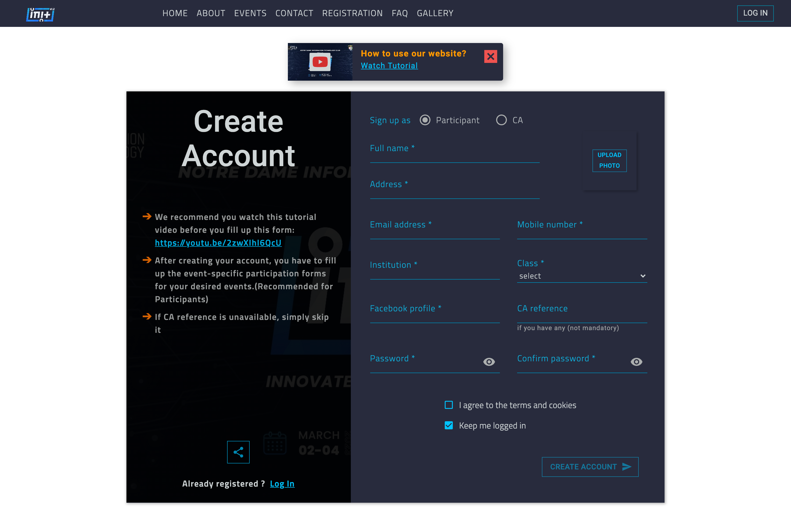</td>
  </tr>
  <tr>
    <td><strong>Browse festival moments</strong><br /><sub>A responsive gallery driven by admin-managed records.</sub></td>
    <td><strong>Create a participant account</strong><br /><sub>One identity for individual and team-based participation.</sub></td>
  </tr>
</table>

</details>

<details>
<summary><strong>Organizer experience</strong></summary>
<br />

<table>
  <tr>
    <td width="50%">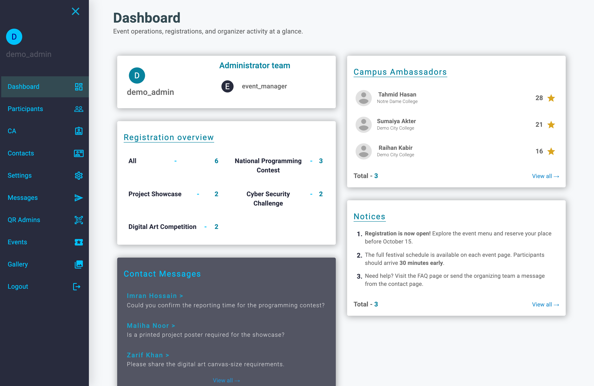</td>
    <td width="50%">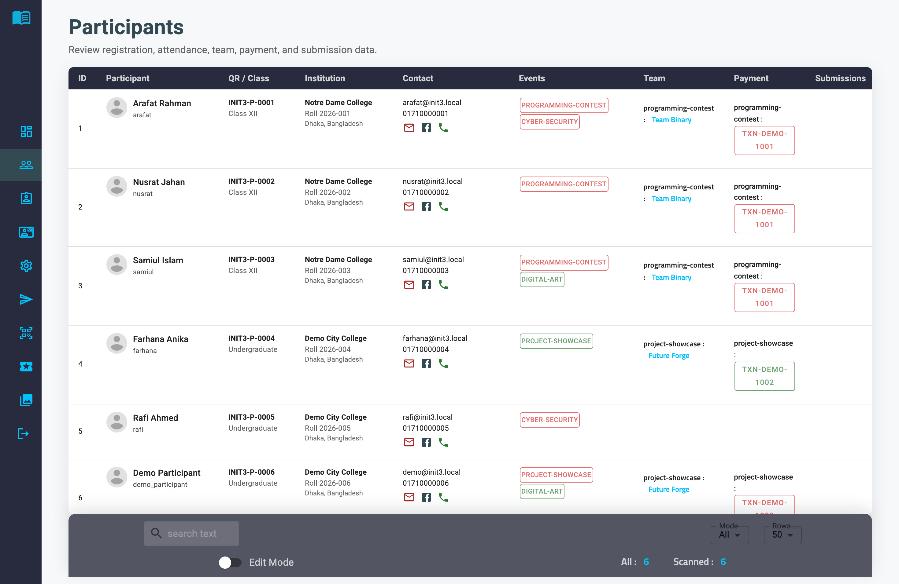</td>
  </tr>
  <tr>
    <td><strong>See the operation at a glance</strong><br /><sub>Registrations, ambassador activity, notices, messages, and admins.</sub></td>
    <td><strong>Work with participant records</strong><br /><sub>Teams, payments, submissions, and per-event attendance in one table.</sub></td>
  </tr>
  <tr>
    <td width="50%">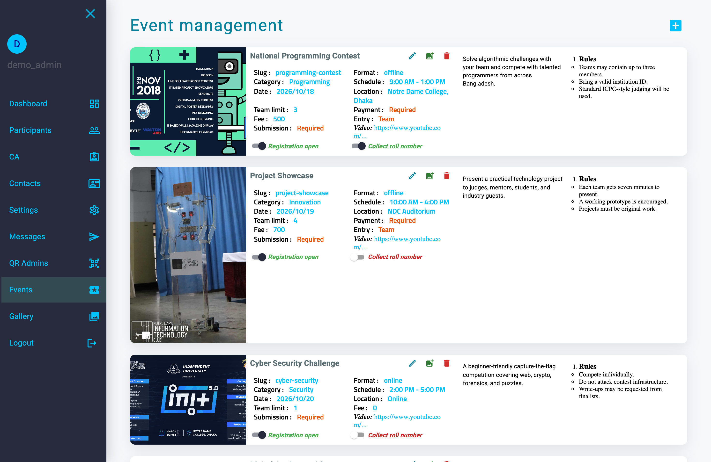</td>
    <td width="50%">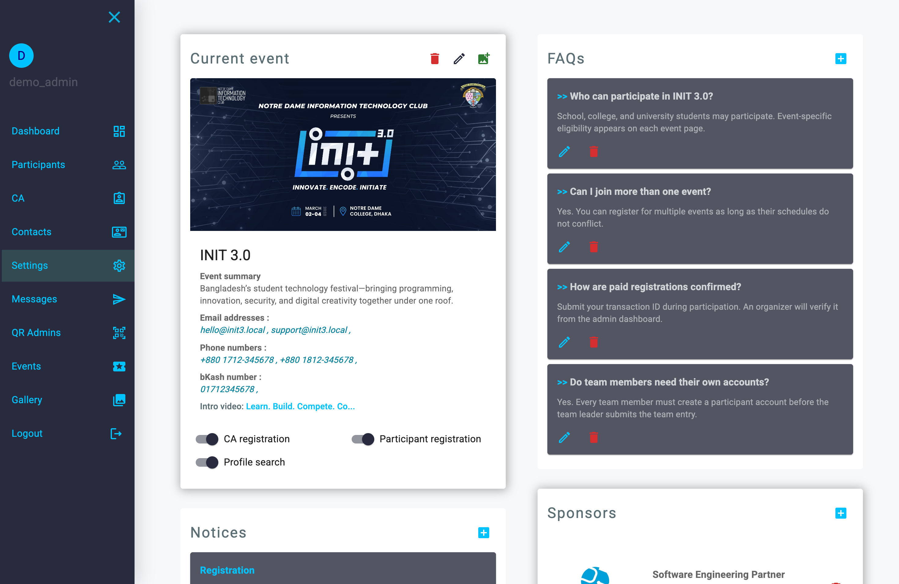</td>
  </tr>
  <tr>
    <td><strong>Configure events</strong><br /><sub>Control registration, team size, price, fields, media, and submissions.</sub></td>
    <td><strong>Manage the public site</strong><br /><sub>Update permissions, notices, FAQs, sponsors, and shared page content.</sub></td>
  </tr>
</table>

</details>

<details>
<summary><strong>Mobile QR check-in</strong></summary>
<br />

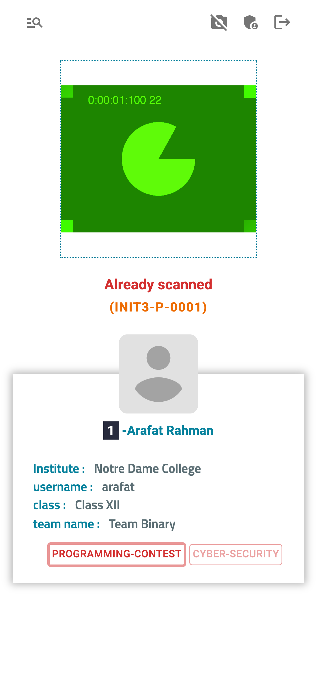

**Scan and verify at the door**

The dedicated operator flow detects repeat scans and surfaces identity, institution, team, and event attendance in one mobile view.

</details>

## What is included

- **Public website** — landing page, event discovery, event details, notices, FAQ, gallery, contact form, ambassadors, and sponsors.
- **Participant portal** — registration, login, editable profiles, event enrollment, teams, payment references, and file or link submissions.
- **Campus ambassador workflow** — a separate account mode with referral codes, points, rankings, and organizer controls.
- **Admin console** — participant operations, event configuration, content management, inquiries, outbound messages, gallery, sponsors, and QR accounts.
- **QR workflow** — dedicated operator authentication, QR lookup, manual search, and event-specific attendance updates.
- **Media pipeline** — browser-side image compression plus Multer uploads for banners, profiles, events, gallery images, thumbnails, submissions, and sponsors.

## Quick start

### Prerequisites

- Node.js 18 or newer
- npm
- MySQL 8

The repository has been verified locally with Node.js 24 and MAMP MySQL 8. If you use a standard MySQL installation, its port will usually be `3306` instead of MAMP's `8889`.

### 1. Clone and install

```bash
git clone https://github.com/khalid999devs/init3.0.git
cd init3.0

cd server
npm install

cd ../client
npm install
```

### 2. Create a demo database

Run this with your preferred MySQL client:

```sql
CREATE DATABASE init3_demo
  CHARACTER SET utf8mb4
  COLLATE utf8mb4_unicode_ci;
```

### 3. Configure the API

```bash
cd ../server
cp .env.example .env
```

Review `server/.env` before continuing. A MAMP-style local configuration looks like this:

```dotenv
NODE_ENV=development
PORT=8001

DB_USER=root
DB_PASS=root
DB_NAME=init3_demo
DB_HOST=127.0.0.1
DB_PORT=8889
```

Replace the example values for `ADMIN_SECRET`, `CLIENT_SECRET`, and `QR_SECRET` with long, random strings. `REMOTE_CLIENT_APP` is a comma-separated CORS allowlist; the defaults cover the local React client.

### 4. Load the demo data

```bash
cd server
npm run seed:demo
```

> [!CAUTION]
> The demo command rebuilds its target database with `sync({ force: true })`. To prevent accidental data loss, the script refuses to run unless `DB_NAME` ends with `_demo`.

### 5. Start the API and client

Run the API in one terminal:

```bash
cd server
npm start
```

Run the React client in a second terminal:

```bash
cd client
npm start
```

| Service | Local URL |
| --- | --- |
| Web application | `http://localhost:3000` |
| REST API | `http://localhost:8001` |

The development API address is defined in `client/src/data/requests.js`. Change it when the client and API are deployed to different hosts.

## Demo accounts

`npm run seed:demo` creates the following local-only accounts:

| Experience | Login | Password | Where to sign in |
| --- | --- | --- | --- |
| Admin console | `demo_admin` | `DemoAdmin123!` | `/adminLogin` |
| Participant portal | `demo@init3.local` | `DemoUser123!` | `/login` using **Participant** mode |
| QR scanner | `demo_scanner` | `DemoUser123!` | `/qrLogin` |

The seed also creates a second administrator named `event_manager` for multi-admin dashboard states.

## Architecture

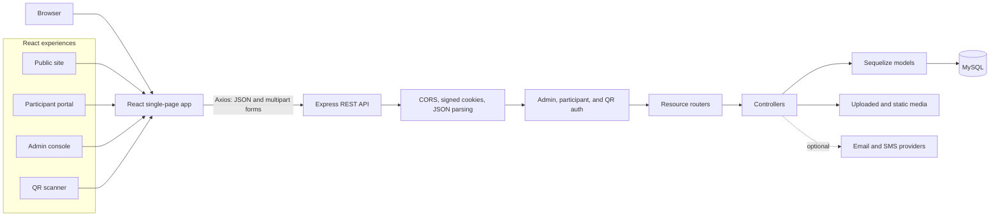

### Frontend

React Router maps four experiences into one application. Public and participant routes load normally; administrator pages are lazy-loaded so visitors do not download the operations console up front. A shared context fetches platform settings and the current event catalog, while smaller custom hooks handle public and authenticated requests.

### Backend

The Express API is organized by resource. Routers compose authentication, validation, and upload middleware before handing work to controllers. Controllers use Sequelize for persistence and expose a predictable JSON response shape to the client. Express also serves user uploads and the demo image library.

### Authentication and access

- Passwords are hashed with bcrypt.
- Successful login creates a signed, HTTP-only cookie containing a short JWT identity payload.
- Admin, participant/CA, and QR sessions use different secrets and validation middleware.
- Public reads remain open; organizer mutations and operational data require the correct role.
- CORS uses an environment-driven allowlist and permits credentials for approved client origins.

For a public production deployment, enable secure cookies, use managed secrets, review upload limits and validation rules, and place the API behind HTTPS.

### QR check-in: design and algorithms

The QR subsystem treats the code as an opaque lookup key rather than embedding personal data in the image. During registration, the API creates a time-derived unique code, stores it on the participant or campus-ambassador account, and mirrors it into `ParEvents.clientQR`. The participant profile renders that value as an SVG with `qrcode.react`, which keeps the code sharp at both screen and print sizes.

Check-in operators use a separate account type. An administrator assigns each QR account to an event, and the scanner login signs a five-hour JWT containing the operator ID, username, and event key. The token is returned in a signed, HTTP-only cookie; `qrValidate` verifies it before any lookup or attendance mutation reaches the controller. This keeps the public and participant sessions separate from the event-day scanner workflow.

The scan decision is a small event-specific state machine. `eventInfo` is stored as a JSON object whose keys are event values and whose values represent attendance:

```text
state = participant.eventInfo[operator.event]

if state is missing  → NOT_REGISTERED_FOR_THIS_EVENT
if state is 1        → ALREADY_SCANNED
if state is 0        → READY_TO_CHECK_IN
                       then update state from 0 to 1
```

The client reads the rear-facing camera through `react-qr-reader`, rejects malformed or unusually long results, and sends the decoded value to `POST /api/qr/scan/:code`. The API resolves `clientQR`, follows either `parId` or `CAId` to the correct identity table, and returns the attendee, team, payment, and event state needed by the operator. When a camera scan is ready for check-in, the client calls `POST /api/qr/updateEvent/:code`; the API constructs an escaped MySQL JSON path and applies `JSON_REPLACE` with bound values. An unchanged row is treated as an already-applied or unmatched update instead of silently reporting another success.

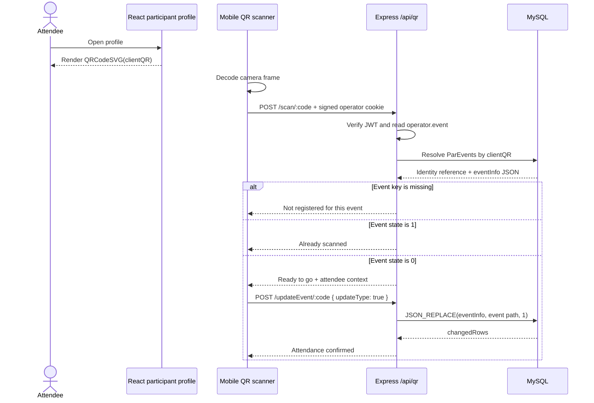

When a camera is unavailable or a printed code is damaged, the same operator screen offers a permission-controlled prefix search across participants and ambassadors. Selecting a result reuses the scan endpoint, but manual mode leaves the final attendance change under operator control. Both entry paths therefore converge on the same authorization and state rules.

For a high-volume production gate, the next hardening steps would be to parameterize every remaining raw lookup/search query, combine the read-and-update into a database transaction or conditional atomic update to prevent simultaneous-scan races, rate-limit scanner endpoints, and use high-entropy or signed QR payloads when codes must resist guessing. The current design is appropriate as a transparent event-platform demonstration; these changes would strengthen it for adversarial public use.

### Data model

The model design keeps account identity separate from event participation state:

| Model group | Responsibility |
| --- | --- |
| `Participants`, `CAs` | Identity, profile, login, and contact data |
| `ParEvents` | Event status, attendance, teams, fees, transactions, submissions, and roll numbers |
| `Events`, `Teams` | Contest configuration and team membership |
| `PageSettings`, `Notices`, `Faq` | Public content and feature permissions |
| `Gallery`, `Sponsors` | Public media and partner presentation |
| `Admin`, `QRAdmins`, `Contact` | Organizer access, scanner access, and inbound inquiries |

`Participants` and `CAs` each have a one-to-one Sequelize association with `ParEvents`. That common event-state record lets the application reuse participation logic while preserving the differences between participant and ambassador accounts.

## Main application flows

1. **Discover** — the client loads page settings and the public event catalog from the API.
2. **Register** — a participant or campus ambassador creates an account and receives a QR identity.
3. **Participate** — the participant joins a solo event or the team leader creates an event-specific team.
4. **Verify** — organizers review payment references, submissions, and event status from the admin console.
5. **Check in** — a QR operator scans or searches for the participant and records attendance for the selected event.
6. **Communicate** — organizers publish notices or contact participants through the configured email/SMS integrations.

## API map

| Namespace | Responsibility | Access |
| --- | --- | --- |
| `/api/events` | Event discovery and event administration | Public reads, admin writes |
| `/api/client` | Accounts, profiles, participation, teams, payments, and submissions | Participant/CA or admin, depending on operation |
| `/api/admin` | Admin authentication and platform settings | Mixed |
| `/api/adAction` | Permissions, exports, ambassador controls, and attendance actions | Admin |
| `/api/notice`, `/api/faq`, `/api/sponsor` | Public content and protected management actions | Public reads, admin writes |
| `/api/admin/gallery` | Gallery records and uploaded media | Public reads, admin writes |
| `/api/contact` | Public inquiries and organizer replies | Mixed |
| `/api/qr` | Scanner accounts, search, scanning, and event updates | QR operator or admin |

## Demo dataset

The deterministic seed provides realistic dashboard states without requiring manual data entry:

- 4 events across programming, innovation, security, and creative categories
- 6 participants covering solo/team, free/paid, verified/pending, and multi-event cases
- 3 campus ambassadors and 2 teams
- 3 contact inquiries, 4 FAQs, and 3 notices
- 3 curated gallery records and 4 example technology partners
- 2 administrators and 1 QR-scanner account

Profile and event images use repository-owned demo assets. Sponsor logos remain external to demonstrate how the application handles remote media.

## Repository map

```text
init3.0/
├── client/
│   ├── public/                 # Static assets and public JSON content
│   └── src/
│       ├── Admin/              # Admin shell, dashboard, and operations pages
│       ├── Client/             # Public site and participant portal
│       ├── QR_scanner/         # Scanner authentication and check-in UI
│       ├── custom_hooks/       # Shared fetch and form behavior
│       ├── customStyles/       # Theme and reusable styling primitives
│       └── global_components/  # Controls shared across application areas
├── server/
│   ├── config/                 # Environment-aware database configuration
│   ├── controllers/            # Request and domain logic
│   ├── middlewares/            # Authentication, validation, uploads, errors
│   ├── models/                 # Sequelize models and associations
│   ├── routers/                # REST endpoints grouped by resource
│   ├── scripts/seed-demo.js    # Guarded deterministic demo seed
│   ├── uploads/                # Runtime-uploaded media
│   └── index.js                # Express composition and startup
├── ss/                         # Product tour media
├── LICENSE
└── README.md
```

## Verification

Build the production client:

```bash
cd client
npm run build
```

The seeded application has also been smoke-tested across:

- Public settings, events, notices, FAQ, sponsors, and gallery endpoints
- Admin login and session validation
- Authenticated event, participant, CA, contact, and QR-account endpoints
- MySQL-backed dashboard data and absolute/local media URL handling

The project does not yet include a full automated test suite. The current repository validation is a production React build plus API and authenticated-flow smoke testing.

## Troubleshooting

### `EADDRINUSE` on port 8001 or 3000

Another development process is already listening on the port. Find it, stop the exact process, and restart the application:

```bash
lsof -nP -iTCP:8001 -sTCP:LISTEN
lsof -nP -iTCP:3000 -sTCP:LISTEN

kill <PID>
```

### The API cannot connect to MySQL

Check that MySQL is running and confirm `DB_HOST`, `DB_PORT`, `DB_USER`, `DB_PASS`, and `DB_NAME`. MAMP commonly listens on `8889`; standalone MySQL commonly listens on `3306`.

### Images are missing

Local database image paths are served by the API, so both applications must be running. The seeded sponsor logos are external URLs and also require internet access.

## Contributing

Issues and focused pull requests are welcome. If you are changing a user flow, include the affected role and route in the pull-request description. Before opening a pull request:

1. Keep secrets and personal data out of commits.
2. Run `npm run build` from `client/`.
3. Update `server/scripts/seed-demo.js` when a feature needs new demo state.
4. Update this README when setup, routes, credentials, or architecture change.

Use the repository's [issue tracker](https://github.com/khalid999devs/init3.0/issues) for bugs and feature proposals.

## License

INIT 3.0 is available under the [MIT License](./LICENSE).
